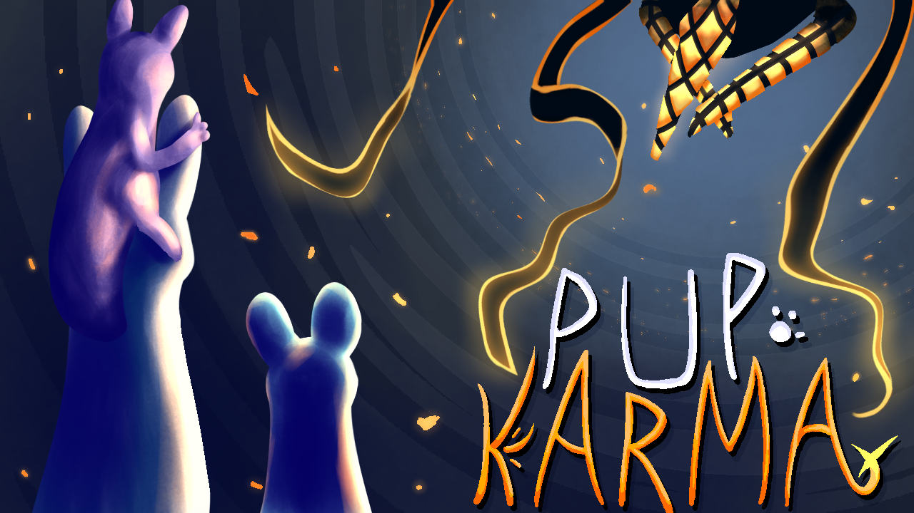

# PupKarma
Add full-fledged karma to your slugpups, the same as the player's!
<p align="center">
<br>

<br><b>Thumbnail made by sluglat</b>
</p>
<br/>

## Now Pup Karma is not just a mod, it's an API! Register your karma for the slugpups you created!
### How do this works:
Pup karma uses `PupClassKarmaInfo.RegisterSlugpup` to register karma for slugpups you created. To use it, you should create a hook for the `RainWorld.PostModsInit` method and add a check for Pup Karma there.  
For example:
```C#
private void On_RainWorls_PostModsInit(On.RainWorld.orig_PostModsInit orig, RainWorld self)
{
    orig(self);
    if (ModManager.ActiveMods.Any(mod => mod.id == "quansly.pupkarma"))
    {
        PupKarma.PupClassKarmaInfo.RegisterSlugpup(ModClassMain.SlugpupNames.ExamplePup, true, 4, 8);
    }
}
```
Where:  
1-st arg: your slugpup name (`SlugcatStats.Name`),  
2-nd arg: should iterators increase karma for slugpup like hunter (`bool`, default is false),  
3-rd arg: the minimum karma that can be received when it is assigned (`int`, default is 0),  
4-th arg: the minimum karma capthat can be received when it is assigned (`int`, default is 4)  
<br/>  
Also, if you are creating multiple slugpups or use other mods for your mod, I highly recommend creating a separate static class containing static methods for other mods and ten using its in `PostModsInit` hook.  
For example:  
``` C#
using PupKarma;

namespace Mod
{
    public static class OtherPlugins
    {
        public static void PupKarmaEnable()
        {
            PupClassKarmaInfo.RegisterSlugpup(ModClassMain.SlugpupNames.SpupOne, true, 6, 9);
            PupClassKarmaInfo.RegisterSlugpup(ModClassMain.SlugpupNames.SpupTwo, false, 2, 5);
            PupClassKarmaInfo.RegisterSlugpup(ModClassMain.SlugpupNames.SpupThree, false, 4, 7);
        }
    }
}    
```
